# Tests on Fisheye Object Detection

It is a note about tests of an AI model. We hope to have an understanding about the capability and accuracy of the AI model for the object detection on fisheye images. Part 1 is the AI model, Part 2 is a road fisheye image dataset. Part 3 is the compilation of the model from pytorch to onnx, then to DRP-AI_TVM.  


## 1. Fisheye Object Detection Model

https://github.com/arda92a/fisheye-object-detection


The fisheye-object-detection project provides a Flask-based web application for object detection and segmentation in fisheye camera images and videos. It supports multiple deep learning models, including YOLO (for object detection and segmentation), RetinaNet, and Faster R-CNN, to detect and classify objects such as bikes, buses, cars, pedestrians, and trucks.


Follow the instructions in the repo' README.md to install dependencies, prepare
model and run the APP,

1. Install Dependencies: 
```
pip install -r requirements.txt
```
2. Prepare Model Files: 

[Download Link](https://drive.google.com/drive/folders/1f5sj08ztjm7DjV1sYxSHa-dVm-vnA56z?usp=sharing) 

We'll use download yolo_object_detection.pt (121M) and put in ./models folder.

3. Run the Application:
```
python app.py
```
Open the web browser, input the url,
```
http://localhost:5000
```

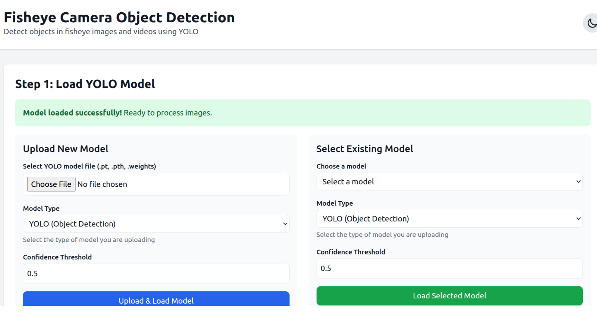

Select the Model,

Upload a fisheye image, here we use the image from the below dataset 

## 2. Fisheye Image Dataset 

A fisheye image dataset used to detect cars and bikes can be found here,

https://github.com/MoyoG/FishEye8K

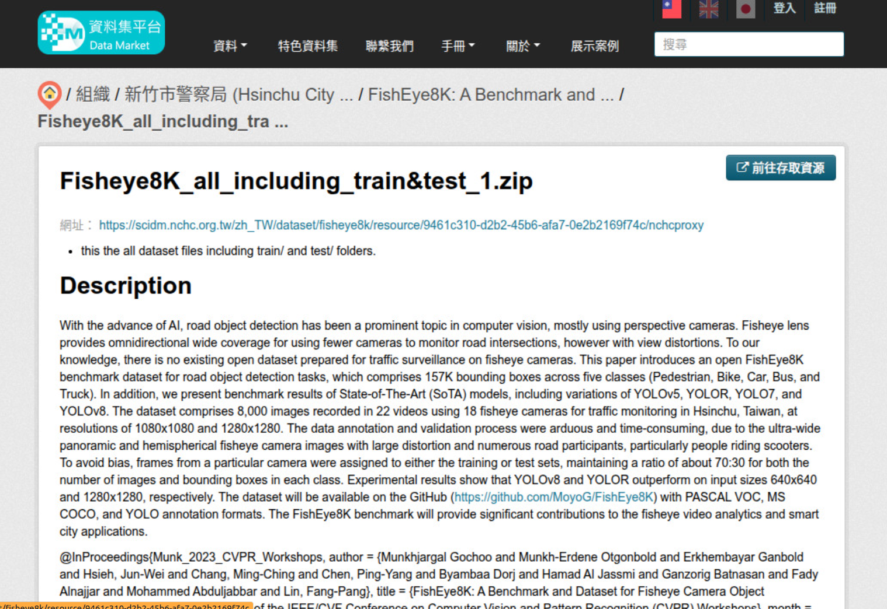

As described in the above repo, the URL of the dataset is as below,

https://scidm.nchc.org.tw/zh_TW/dataset/fisheye8k/resource/f6e7500d-1d6d-48ea-9d38-c4001a17170e

Download the above datdaset, we choose one image file as our test sample as below,

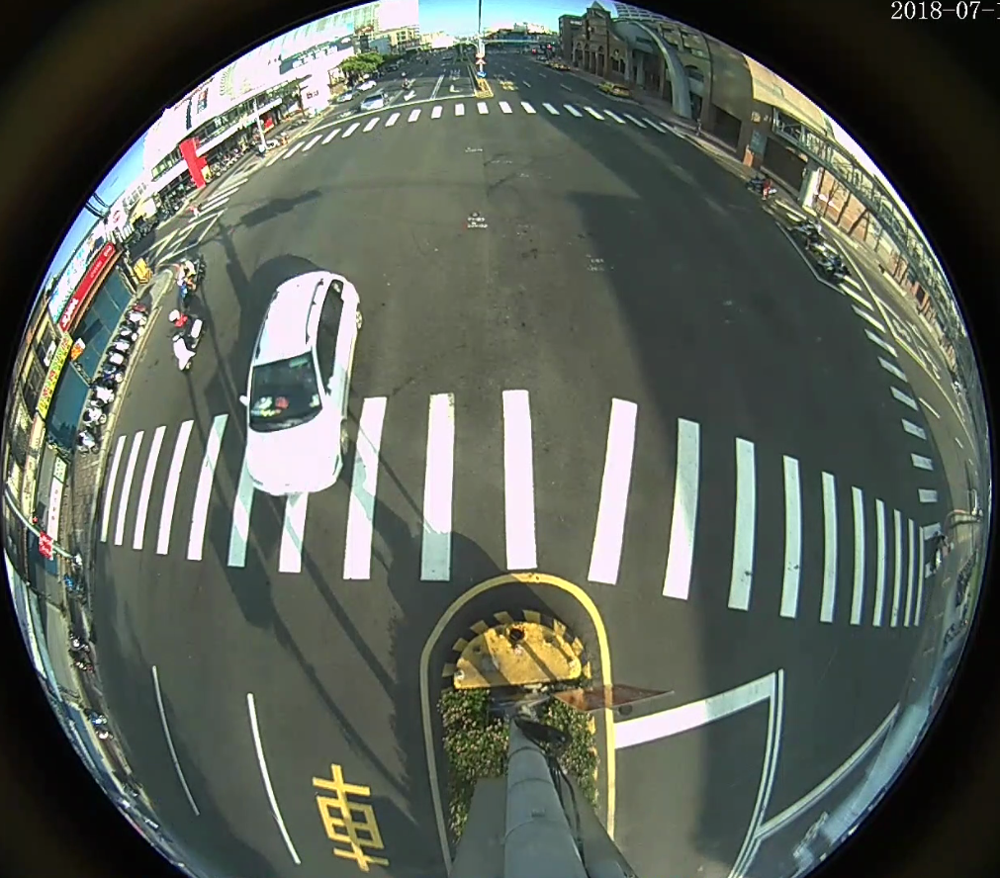

Inference Result from the above APP's web interface: 

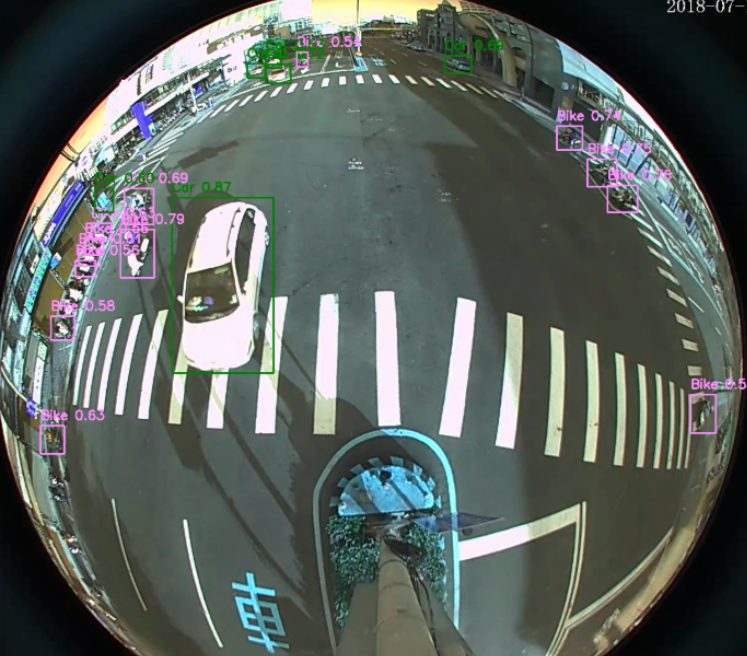

Similarily, we can open a terminal, and directly use yolo command to perform the inference, 

```
yolo predict model=yolo_object_detection.pt source="camera1_A_1.png"
```

Note: if you didn't installed 
```
pip install ultralytics
```
The result is
as below,

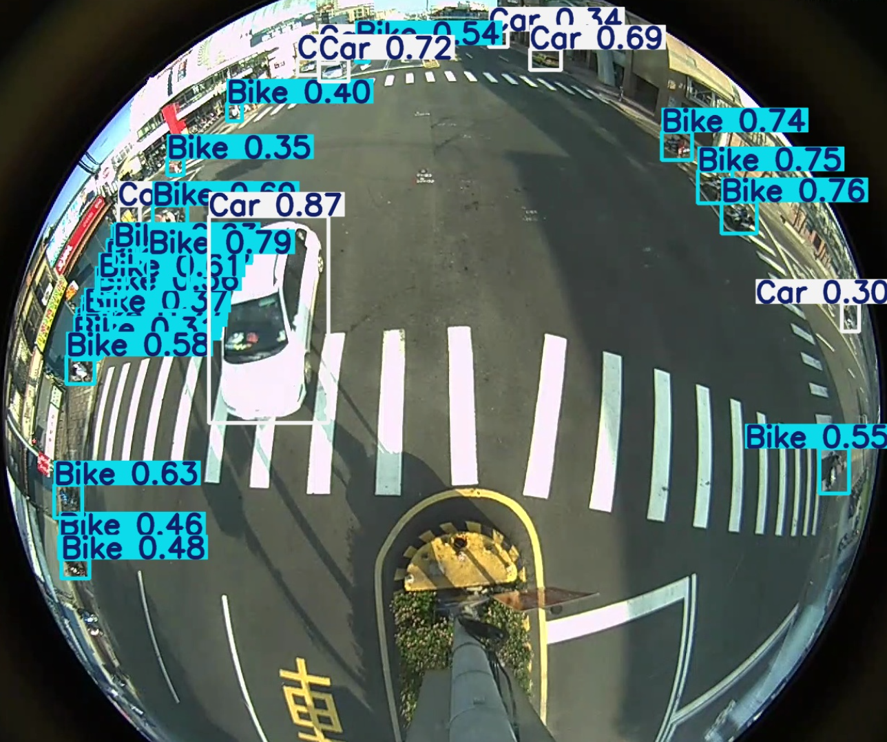


### Test the fisheye image using normal YOLO model

The normal YOLO model will detect objects for 
normal image, but can't detect object for fisheye image.

for normal image,

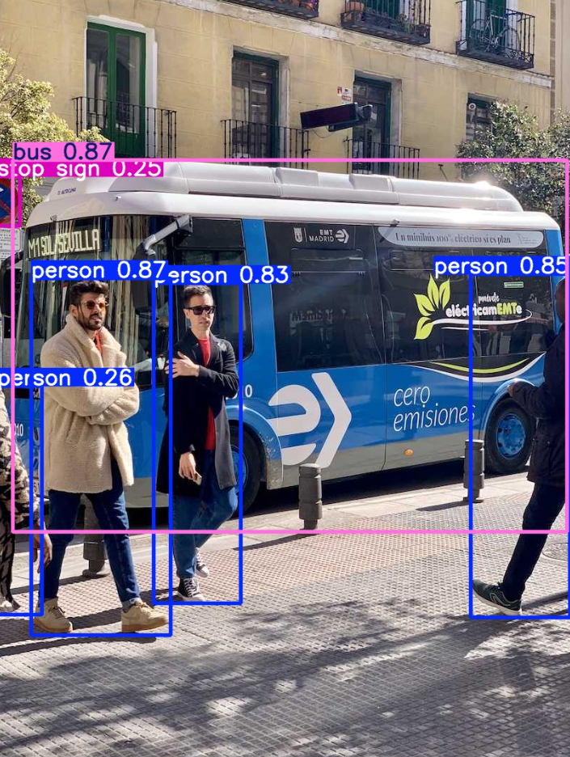

However, for fisheye image,


Nothing has been detected in the above fisheye image.

### Night sight - 1/2

This model can be used to detect object from night vision image well.

The original image is as below,

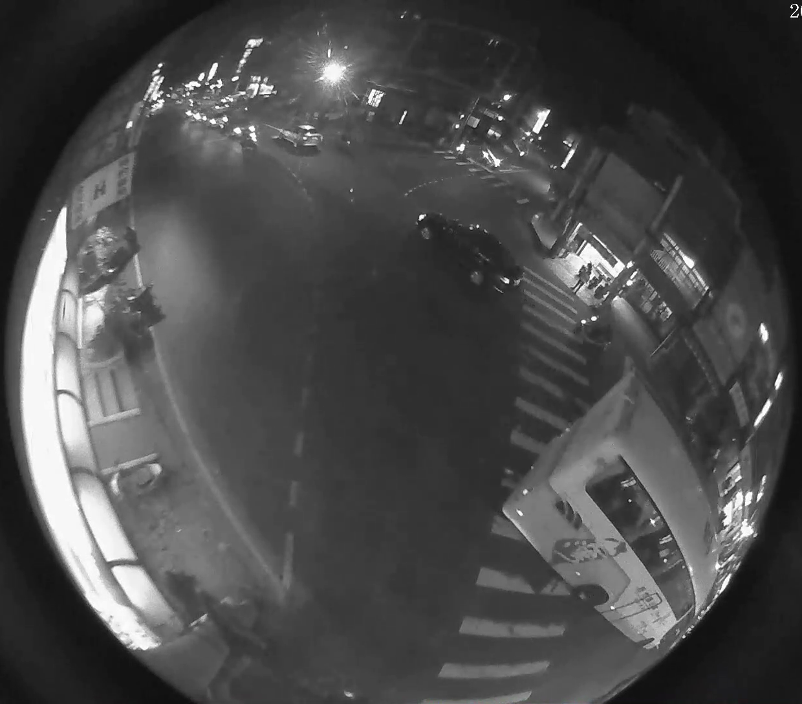

As we can see in the below, alrough the image has poor contrast,  the cars, motorcycles and pedestrians can be detected well. 

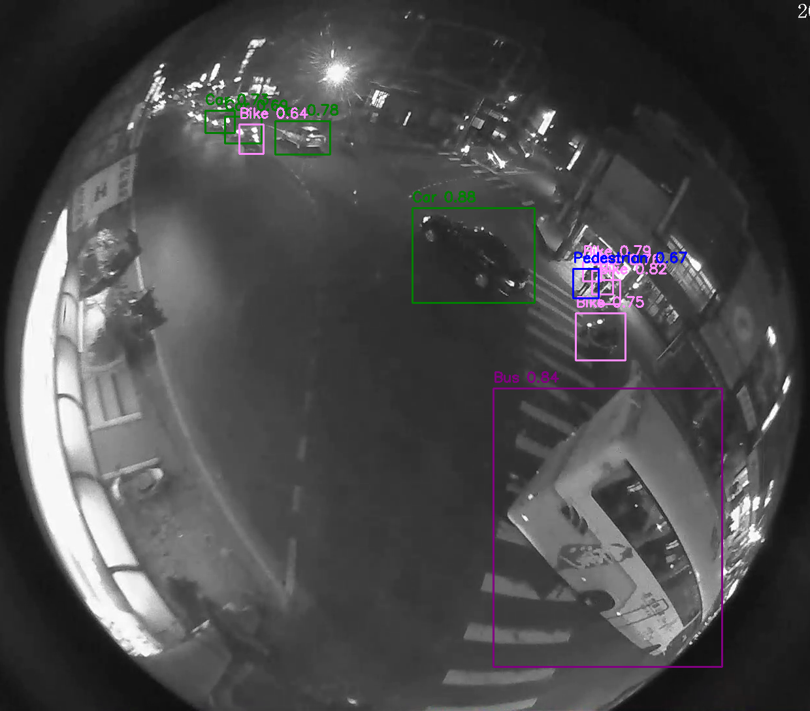

### Night sight - 2/2

The original image is as below,

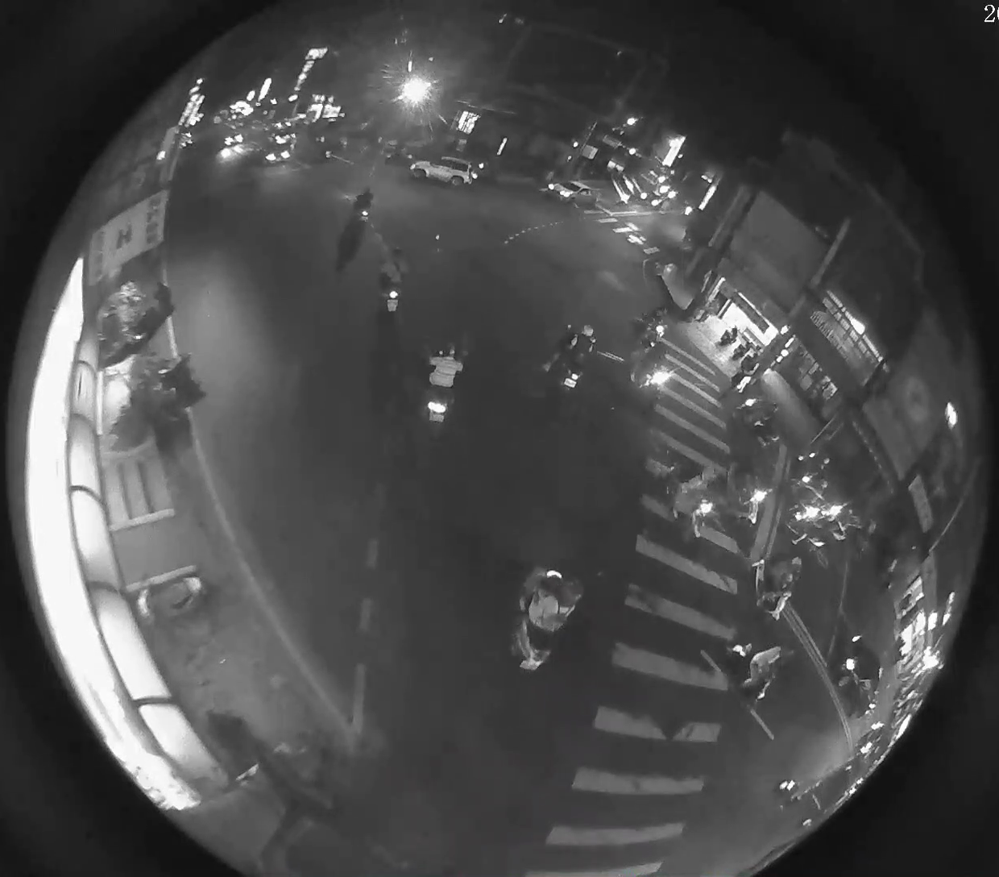

The blurred motocycles at night can also be detected well. 

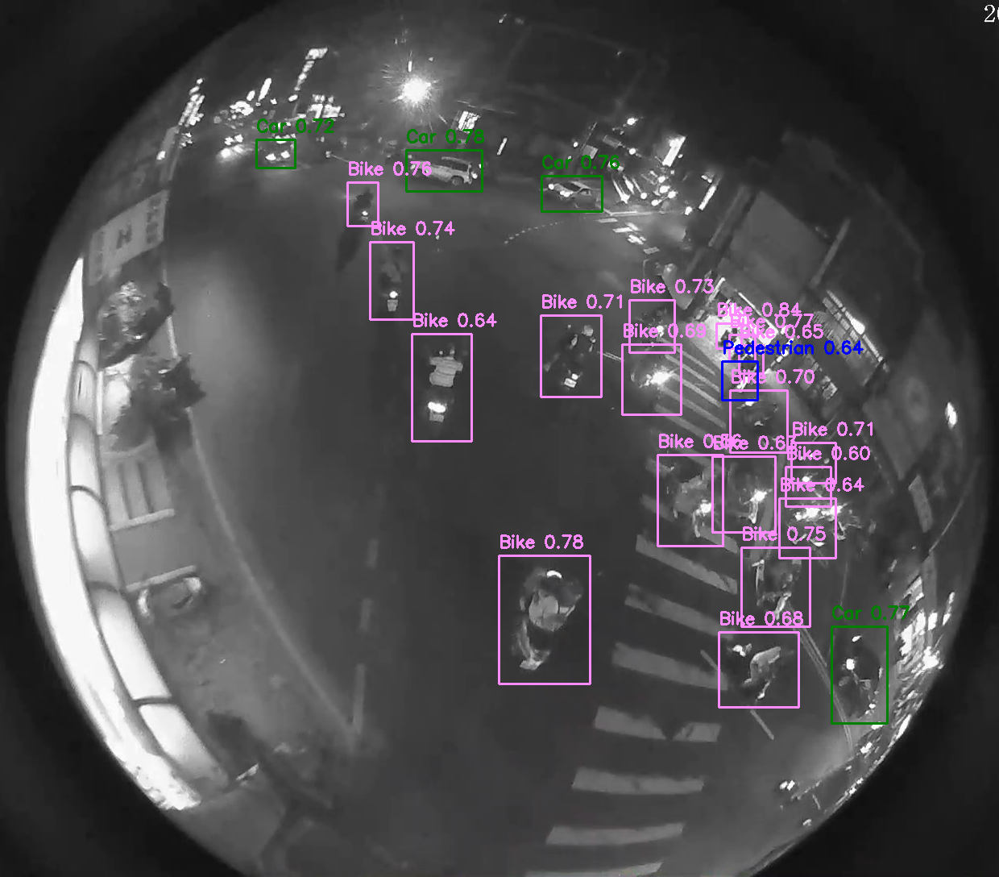


## 3. Compilation of the model

Our next step is using the model on our target embedded system, Renesas RZ/V2H.

### Step 1. Convert PyTorch to Onnx

Run the below pt_to_onnx.py to covnert the model file yolo_object_detection.pt to yolo_object_detection.onnx,

pt_to_onnx.py
```
from ultralytics import YOLO
model = YOLO('yolo_object_detection.pt')
model.export(format='onnx')
```
or run it with more parameters,

pt_to_onnx2.py
```
from ultralytics import YOLO
model = YOLO('yolo_object_detection.pt')
model.export(
    format='onnx',
    imgsz=(640,640),
    keras=False,
    optimize=False,
    half=False,
    int8=False,
    dynamic=False,
    simplify=False,
    opset=None,
    workspace=4.0,
    nms=False,
    batch=1,
    device="cpu"
)

```
### Step 2. Find input name and input shape 

We need to find out needed parameters for the next compilation step. Use the python program below,

onnx_input_info.py

```
import onnx
model_path = "yolo_object_detection.onnx"
model = onnx.load(model_path)
graph_inputs = model.graph.input    
for model_input in graph_inputs:
	input_name = model_input.name
	input_shape = []
	for dim in model_input.type.tensor_type.shape.dim:
		if dim.HasField("dim_value"):
			input_shape.append(dim.dim_value)
		else:
			# This dimension is dynamic (e.g., batch size), often represented by -1
			input_shape.append(-1)
	print(f"Input Name: {input_name}, Input Shape: {input_shape}")   

```
The expect output is:
```
Input name: image, Input Shape:[1,3,640,640]
```

### Step 3. Onnx Verification ( Optional )

We can run the python code below to verify the above onnx model.


[Python code ](detection-fisheye.py)

Run
```
python3 detection-fisheye.py  
```

Expected result :

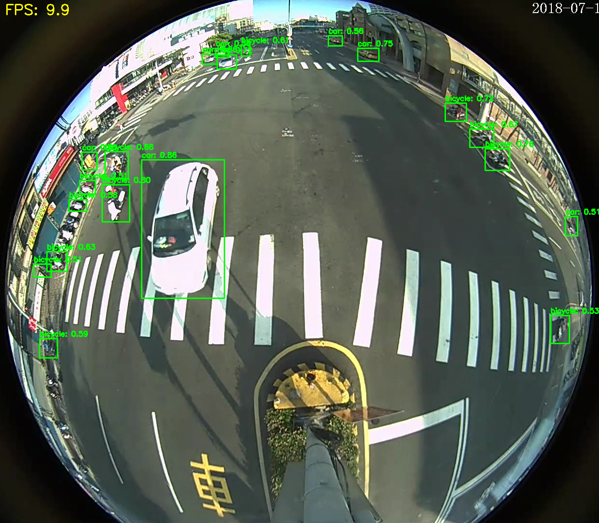

The results looks fine.

### Step 3. Compilation for Renesas/ RZV2H/ DRP-AI-TVM

Reference to:

https://github.com/renesas-rz/rzv_drp-ai_tvm/blob/v2.3.0/tutorials/tutorial_RZV2H.md

We need to prepare the environment first, 

First, build a docker image according to the instructions below,

https://github.com/renesas-rz/rzv_drp-ai_tvm/blob/main/setup/SetupV2H.md

There are 5.20/ 6.00 versions for your choice.

if you use 5.20, switch the branches on the above page from Main to v2.3.0.

```
git checkout v2.3.0
```

After preparing the environment, copy the model file yolo_object_detection.onnx to the folder that the container can access, run the docker container and run the commands below, notice that image name -i and image shape -s parameters are from the previous inspection.
 
```
cd /drp-ai_tvm/tutorial
python3 compile_cpu_only_onnx_model.py ./yolo_object_detection.onnx -o yolo -s 1,3,640,640 -i images

```

The expected output will be in the yolo/ folder

```
tree yolo
yolo
├── deploy.json
├── deploy.params
├── deploy.so
└── preprocess
    ├── addr_map.txt
    ├── aimac_cmd.bin
    ├── aimac_desc.bin
    ├── aimac_param_cmd.bin
    ├── aimac_param_desc.bin
    ├── drp_config.mem
    ├── drp_desc.bin
    ├── drp_param.bin
    ├── drp_param_info.txt
    └── weight.bin

```


